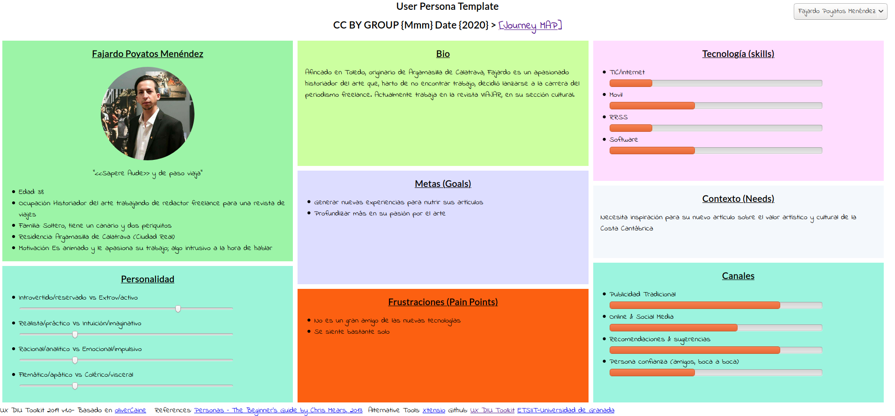
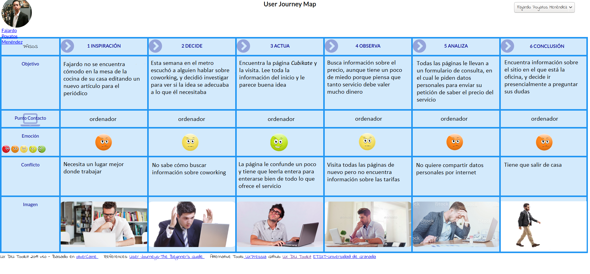
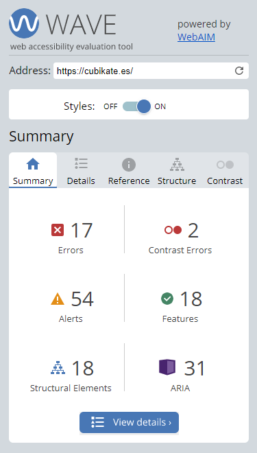
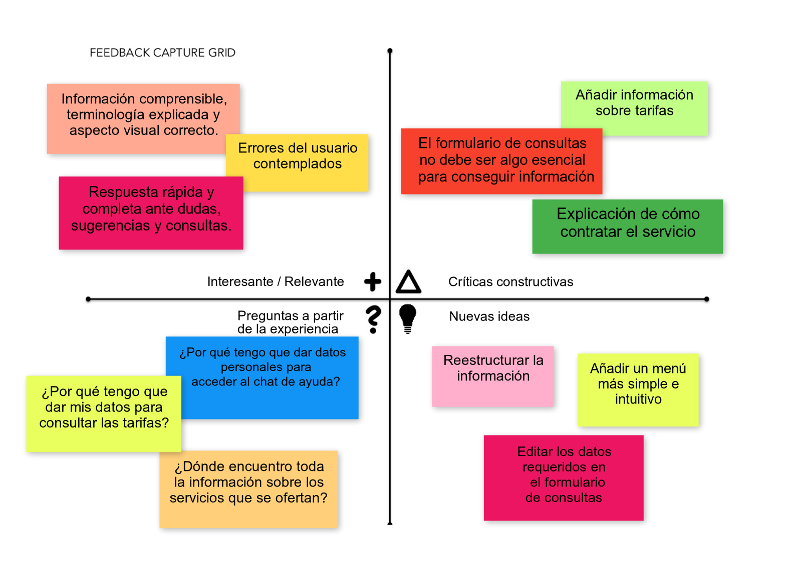
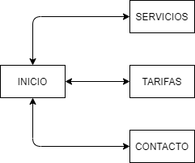
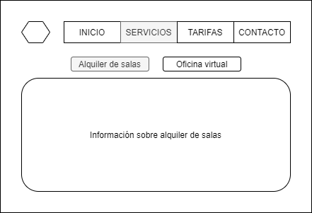
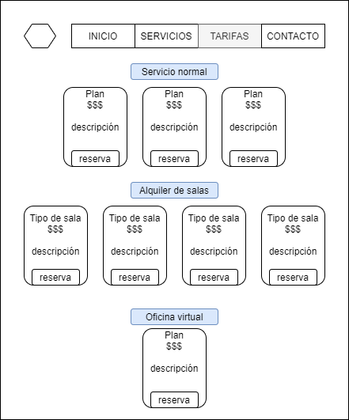
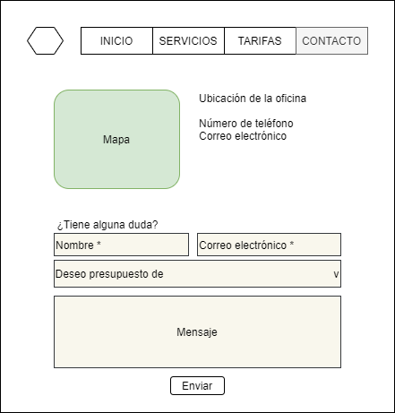

# Propuesta de rediseño de la web de coworking Cubikate

**Diseño de Interfaces de Usuario 2019-20**

Autora: Ana María Romero Delgado

------

En este ejercicio se realiza una propuesta para el re-diseño de la web [Cubikate](cubikate.es), empresa de *coworking*.

## Análisis de la web

### Análisis competitivo

Después de revisar [Cubikate](cubikate.es) se han analizado otras páginas web que también ofrecen servicios de coworking ([ErranT](https://www.errant.es/es/) y [Coforum](coforum.es)), para ver qué características tienen y qué otras ideas aportan.

Se ha concluido que la estructura que suele tener una página de coworking es:

+ Descripción visual (con iconos e imágenes) que represente cómo es el espacio de trabajo, con la equipación y servicios que se ofrecen (internet, puestos de trabajo, cocina, impresión, ...).
+ Descripción de otros servicios como alquiler de salas y oficina virtual.

+ Lista de tarifas según el tiempo a usar el espacio.
+ Formulario de contacto para dudas y consultas.
+ Blog, redes sociales o página donde informar de los eventos que se realizan.

### Persona y Journey Map

Para identificar un punto crítico de la web actual se va a observar como la persona **Fajardo Poyatos Menéndez** (creada para las prácticas de la asignatura) visita la página web en busca un sitio más cómodo donde trabajar.

Fajardo es un periodista freelance reacio a la tecnología y apasionado del arte, que trabaja para una revista de viajes:

Fajardo decide buscar un sitio distinto para realizar su trabajo, encontrándose con el problema de que para obtener información tiene que aportar datos personales y esperar una respuesta:

Muchas personas prefieren no publicar ni compartir datos personales por internet, o simplemente prefieren no ponerse en contacto personalmente con la empresa. Se debería aportar toda la información sin necesidad de restricciones así, para no perder clientes de esta forma.

### Accesibilidad

Se ha analizado la accesibilidad del sitio web usando la herramienta online [WAVE](https://wave.webaim.org/) (Web Accesibility Evaluation Tool) y se han obtenido los siguientes resultados:

Se puede observar que existen errores relacionados con la falta de texto alternativo, etiquetas y links vacíos, errores de contraste en el texto situado encima de las imágenes y presencia de texto justificado.

Todos estos ítems son mejorables para que la página web tenga una mejor accesibilidad.

### Test de usabilidad

Se ha pasado un [test de usabilidad](valoracion_usabilidad.pdf) a la página web, y ha obtenido una puntuación de **89 puntos** (buena).

La web está bastante bien y aporta lo que se espera de una página de información sobre una empresa que ofrece servicios de coworking, pero hay algunos conceptos e ideas importantes que se pueden aplicar, además de algunas características que se pueden mejorar. 

### Malla receptora de información

Como conclusión al uso de la web y a los resultados del test de usabilidad, se ha creado este diagrama con los aspectos más destacados:

En general, la página ofrece la información esencial sobre este tipo de servicio, aunque falta alguna información que se reserva solo para las personas que contacten con la empresa mediante el formulario de contacto, por correo electrónico o por teléfono.

Partiendo de las fortalezas, de las debilidades y de las preguntas que se plantean los usuarios, se proponen las siguientes ideas generales para mejorar la web:

1. **Editar el formulario de contacto:** no exigir tanta información personal a la hora de escribir una consulta.
2. **Reestructurar la información**: una nueva estructura de páginas web con la información dividida en diferentes páginas permitirá a los usuarios ubicarse mejor y acceder a la información que necesitan rápidamente.
3. **Rediseñar la página**: darle una nueva apariencia y organización a la información de la página.

## Propuestas de valor

### Editar el formulario de contacto

Hay distintas formas de ponerse en contacto con la empresa: mediante teléfono, email, chat de ayuda o formulario de consulta.

Para que personas reacias a la tecnología y a compartir datos personales, es suficiente pedir un nombre, un correo y la consulta para ponerse en contacto con la empresa. Si después se necesita más información como el número de teléfono o datos de la empresa contratante, ya se pedirán por correo o por otras vías.

Esto solucionaría el problema de Fajardo al consultar información en la página web.

### Reestructuración de la información y nuevo menú

Actualmente hay mucha información similar repartida por las páginas del sitio web, por lo que se propone esta nueva estructura que pretende que el mismo tipo de información esté situado en solo una página:

La estructura de la web (sitemap) quedaría así:

Cada término utilizado en el sitemap (labelling) significa:

+ **Inicio**: contendrá un resumen del servicio que se ofrece, explicando el concepto de coworking, cómo es el espacio de trabajo y qué equipación hay disponible (internet, puestos de trabajo, cocina, impresión, ...). 
+ **Servicios**: descripción de los otros servicios que se ofrecen, tales como el alquiler de salas y la oficina virtual. 
+ **Tarifas**: explicar detalladamente el precio de cada servicio mencionado.
+ **Contacto**: información de contacto, tal como teléfono, email, ubicación y formulario para consultas.

Todas estas páginas estarán bien referenciadas por links en el menú estático que hay debajo de la cabecera, para poder acceder a ellas indistintamente de la página en la que se encuentre el usuario.

En la cabecera, además del logo, debería aparecer el nombre de la empresa. Así se da mucha más información que mostrando simplemente el logo, además de que otros posibles usuarios que vean cómo se usa la página podrán identificar y recordar el nombre.

Por último, toda la información sobre redes sociales, aviso legal, condiciones de uso, política de privacidad, dirección y teléfono debería aparecer en el footer de la web.

### Rediseño de las páginas

Al reestructurar y añadir información al sitio, es necesario rediseñar algunas páginas de la web. Estas son las nuevas pantallas de la interfaz:

| Página                                                       | Boceto                    |
| ------------------------------------------------------------ | ------------------------- |
| **Inicio** Está bien diseñada como está ahora mismo. No es necesario cambiar nada porque contiene toda la información necesaria y en una estructura correcta. |                           |
| **Servicios** Describe los dos servicios de alquiler de salas y oficina virtual. Hay un submenú estático para poder ver de forma sencilla todos los servicios que se ofrecen. |  |
| **Tarifas** Todas las tarifas de todos los servicios bien detalladas. |    |
| **Contacto** Datos de contacto, formulario de consulta  y mapa interactivo con la ubicación de la empresa. |   |

## Conclusiones finales

La página desempeña bastante bien su función actualmente, pero con estos cambios conseguirá ser más intuitiva y sencilla. Además, no será tan intrusiva a la hora de pedir información de contacto, y será más fácil encontrar el contenido que se necesita porque está mejor ordenado.